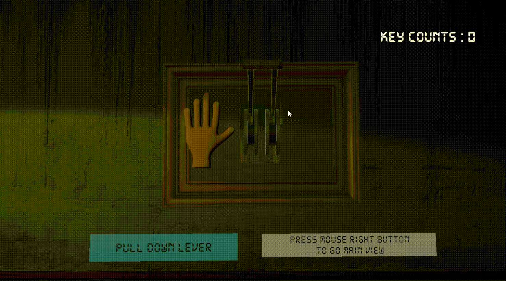

# I_Tracker 👁️

컴퓨터 비전을 이용한 방탈출 공포 게임

### 게임 목표 🚀
 - 열쇠 3개를 미션을 통해 괴물이 오기 전에 문을 열고 탈출하기

### 게임 규칙 ♟️

- 눈을 이용하여 사물을 바라보고 마우스 클릭하여 상호작용 한다

- 괴물을 바라보면 괴물은 움직이지 않는다 

- 괴물이 붙잡으면 게임오버

### 미션 📖
1. 빠르게 비밀번호를 구하여 키패드를 입력하기  

2. 레버를 바라보고 손을 쥐어 레버를 당기기  

3. 그림과 가위바위보로 승리하기  


### 게임 플레이 방법(250605)
0. 웹캠이 있는 윈도우 컴퓨터를 준비한다. (opencv.videocapture(0) 기준)
1. 게임을 다운로드 한다.
2. Python/Main.py를 실행한다.
3. Escape Room.exe를 실행한다.

### 게임 실행 파일 🗂️
[](https://1drv.ms/u/c/b999985f3615a77a/EXWc1TZ66q5Ag3T3PVfnA2QB6H83w4_Qv6itJjO1TaacTQ?e=nEOmhq)

### 게임 시연 영상 🎬  

[](https://youtu.be/qd9UHSmd3cw)


## 사용된 모듈 🧱

#### OpenCV

OpenCv는 컴퓨터 비전에 관한 오픈소스 프레임워크로 이미지 처리와 프로세싱을 지원한다. 보편적으로 사용되어 선택하였다.

---
#### Unity
Unity 회사에서 개발한 게임 엔진이다. 보편적으로 사용되고 에셋의 선택지가 많아 선택하였다.

---

#### MediaPipe

MediaPipe는 구글에서 개발한 실시간 영상 인식 프레임워크로, 신체 부위의 위치를 정확하게 추적한다.  

첫 프레임에서는 탐지기가 동작하고, 이후에는 추적기가 이전 프레임 결과를 바탕으로 연속적으로 랜드마크를 추정한다. 만약 추적 신뢰도가 낮아지거나 객체가 사라지면 다시 탐지기가 동작된다.  

이런 방식으로 연산 효율성을 높이고, 실시간 성능을 보장하여 선택하였였다.


---
### Flow Chart 📊


## 파이썬 스크립트 및 구조 🏛️

### Network.py

- 시스템의 **네트워크 통신**을 담당한다.

- **UdpManager, UdpState** 클래스를 담당한다.

#### UdpState

|이름|자료형|설명|
|-|-|-|
|current|int|현재 상태를 표시한다.|
|screen_size|list|Capture 상태로 넘어가기 위한 변수. 창 크기를 나타낸다.|
|calibration_points|dict|Running 상태로 넘어가기 위한 변수. Homography 점 4개를 반환한다.|
|-|-|-|
|is_get_screen()|bool|screen_size이 수신되었는지 확인하는 함수.|
|is_all_captured()|bool|calibration_points가 수신되었는지 확인하는 함수.|
|capture(w, h, iris)|void|점을 중심으로 가로 2w, 세로 2h인 calibration_points를 저장한다.|

#### UdpManager

|이름|자료형|설명|
|-|-|-|
|ip|string|보낼 IP를 설정한다.|
|send_port|int|보낼 포트를 설정한다.|
|receive_port|int|받을 포트를 설정한다|
|-|-|-|
|send(data)|bool|data를 UTF-8로 인코딩하여 BYTE로 송신한다. 성공시 True를 반환한다.|
|receive(message_type)|string|BYTE를 받아서 UTF-8로 디코딩하여 반환한다. 실패시 빈 문자열을 반환한다.|
|close()|void|모든 소켓을 닫고 연결을 종료한다.|
---
    Udp로 보내게 될 data의 형식을 가장 작게 압축할 수 있는 방식은 ASCII, UTF-8이 있으나,
    ASCII가 UTF-8보다 범용성이 떨어지기에 만약을 위해 UTF-8을 인코딩 방식으로 선정했다.

    또한, 수신과 동시에 이미지 처리를 해야 함으로, 동기 처리방식이 아닌, 비동기 처리를 선택했다.

데이터를 보내기 위한 문자열 처리과정은 함수 
```python
get_send_str(iris, hand)
```
으로 처리하여 문자열을 반환한다.

---

### Tracker.py

- **OpenCv** 프레임워크를 이용하여 **이미지 캡처와 프로세싱**을 한다.

- **MediaPipe** 프레임워크를 이용하여 **손과 눈의 위치**를 추적한다.

- **Tracker** 클래스를 담당한다. 

#### Tracker

|이름|자료형|설명|
|-|-|-|
|face_mesh|mp.solutions.face_mesh|MediaPipe의 Face Mesh 모듈|
|hands|mp.solutions.hands|MediaPipe의 Hands 모듈|
|height, width|int|이미지의 가로와 세로길이를 저장한다.|

|이름|자료형|설명|
|-|-|-|
|set_image_size(img)|void|해당 이미지의 가로와 세로길이를 저장한다.|
|get_iris_pos(multi_face_landmarks)|(x,y)|홍채의 위치를 반환한다.|
|get_hand_pos(multi_hand_landmarks)|list(x,y,z)|손의 위치를 반환한다.|
|process(image_bgr, debug= False)|iris_pos, hand_pos|bgr형식의 이미지를 받아 홍채의 위치와 손의 위치를 반환한다.|
---
468개의 face landmark에서 두 홍채 landmark만 추출한다. 홍채를 인식함에 있어서 두 홍채는 대부분 같이 움직임으로, 두 홍채 좌표의 평균을 반환한다.

    손은 정수 x, y, z로 반환되는데 이 때, y축은 유니티 환경에 맞추기 위해 y축 대칭으로 처리된다. z는 정규화된 상대 깊이 값에 변화율을 높이기 위해 100을 곱한 정수를를 반환한다.  

총 21개의 좌표를 2차원 list로 반환한다.

face_landmark, hand_landmark는 다음과 같이 인덱싱 되어있다.


---

### xyMapper.py

- **눈의 위치 좌표를 화면 좌표로 변환**하는 역할을 한다.

- 이 때 **호모그래피(Homography) 변환**을 사용한다.

- **xyMapper** 클래스를 담당한다.

#### xyMapper
|이름|자료형|설명|
|-|-|-|
|H|np.array|호모그래피 행렬|

|이름|자료형|설명|
|-|-|-|
|xyMapper(calibration_points, screen_size)|void|호모그래피 계산을 위한 인수를 받고 호므그래피 행렬을 계산한다.|
|compute_homography(homography_points)|void|호모그래피 계산을 하여 H를 저장한다.|
|map_coordinates(xy_iris)|(x, y)|좌표를 호모그래피 행렬을 이용해 화면 위의 좌표로 변환하여 반환한다.|

---

호모그래피의 2차원 평면을 변환을 응용해 카메라로 찾은 홍채 위치를 모니터 위의 점으로 변환시킨다.

힝싱 화면 크기 사이의 값으로 반환한다. 

### 4. Main.py

- **메인 프로그램**으로, 전체 시스템의 실행을 담당한다.

- 각 **상태(UdpState)**에 따라서 적절한 메소드를 실행한다.

- **Tracker** 에서 추적한 눈/손 위치 정보를 **xyMapper** 를 통해 화면 좌표로 변환하고, **UdpManager**를 통해 유니티 프로세스에 **UDP 방식으로 실시간 전송**한다.

- 통합된 **App** 클래스를 담당한다.

---
#### App
|이름|자료형|설명|
|-|-|-|
|video|cv.VideoCapture()|Video_Index(기본: 0) 인 cv.VideoCapture 모듈|
|tracker|Tracker|Tracker 클래스 인스턴스|
|xyMapper|xyMapper|xyMapper 클래스 인스턴스|
|udp|UDPManager|UDPManager 클래스 인스턴스|
|state|UDPState|UDPState 클래스 인스턴스|

|이름|자료형|설명|
|-|-|-|
|read_video()|image(np.array)|video를 읽고, 성공하면 이미지를 반환한다. 실패시 프로세스가 종료된다.|
|wait_process()|void|wait state(0)일 때 진행되는 프로세스. ScreenSize를 저장한다.|
|capture_process(iris, shape)|void|capture state(1)일 때 진행되는 프로세스. xyMapper를 생성한다.|
|run_process(iris, hands)|void|매핑된 홍채 좌표와 손 좌표를 Udp로 전송한다.|
|process()|void|반복하여 처리되는 프로세스.|
|close()|void|종료시 호출되는 함수.|

---

    기존에는 모니터의 모서리 점 4개를 유니티 신호를 기반으로 측정하여 홍채 위치를 저장하고 이를 통해서 더욱 세밀한 값을 얻을려 했다.  
    그러나 웹캠 해상도의 문제와 동적인 얼굴 움직임들로 인한 기준점 변경 등 다양한 환경변수를 제거하고자 정적인 사각형을 사용하기로 하였다.   
    이 때 사각형은 가로 세로는 이미지 크기의 1/2, 가운데를 바라봤을 때의 홍채 위치가 중심인 사각형으로 설정하였다.

---

## Unity 스크립트 및 구조 🏛️

#### UdpManager

- **Udp 통신**을 담당한다.

|이름|자료형|설명|
|-|-|-|
|targetIp|string|보낼 IP를 설정한다.|
|targetPort|int|보낼 포트를 설정한다.|
|receivePort|int|받을 포트를 설정한다|
|startReceiving|bool|수신을 시작할지 설정한다.|
|data|string|처리되지 않은 수신된 data를 저장한다.|

|이름|자료형|설명|
|-|-|-|
|send(data)|void|data를 UTF-8로 인코딩하여 BYTE로 송신한다.|

---
멀티스레드 방법으로 지속적으로 수신을 시도하고, 수신이 성공하면 FaceLandMark에
데이터 처리를 넘긴다.

---

#### FaceLandMark

- **수신된 트래킹 데이터 처리**를 담당한다

|이름|자료형|설명|
|-|-|-|
|EyePoint|Vector2|수신된 홍채 좌표를 저장한다.|
|HandPoints|Vector3|수신된 손 좌표를 저장한다.|
|HandFolds|int|손가락의 접힘 여부를 바이트 정수변환으로 저장한다.|

|이름|자료형|설명|
|-|-|-|
|DataProcessing(data)|void|data를 처리하여 EyePoint와 HandPoint에 저장한다.|

---
손가락이 접혀있는지 여부를 확인하는 방법은 다음과 같은 수식으로 구해진다.  

    ||손가락 끝 좌표 - 손바닥 끝 좌표|| < ||손가락 첫 관절 좌표 - 손바닥 끝 좌표||

각각의 손가락(검지, 약지, 중지, 소지)를 계산하여 부울 값을 받고, 이 이진값을 십진법으로 변환하여 정수로 저장한다.

예를 들면 다음과 같이 표현된다.

|모양|손가락 접힘 여부부(이진법)|변환값값|
|-|-|-|
|주먹|1111|15|
|가위|1100|3|
|보자기|0000|0|

---

#### EyeCheck

- **수신된 데이터와 게임 속 물체의 상호작용**을 담당한다. 

|이름|자료형|설명|
|-|-|-|
|sphereCastRadius|float|레이캐스트 충돌 확인 범위를 설정한다.|
|maxDistance|float|레이캐스트가 탐색할 최대 거리를 설정한다.|
|EnemyOnSight|bool|시야에 적이 들어온 여부를 저장한다.|
---
FaceLandmark의 EyePoint에 맞춰 RayCast를 이용해 2차원 평면일 때 충돌하는 물체를 찾아낸다. RayCast가 반환한 물체가 MissionObject면, 그에 맞는 미션을 불러온다.

---

#### Missions(Mission*.cs)

- **미션을 진행하고 미션 조건에 맞게 성공 여부**를 확인한다. 

- 미션에 따라 **카메라**를 조정한다.

미션의 성공 실패 여부를 보여주기 위해 딜레이 타임을 설정하였으며, Interact 함수를 이용하여 카메라 전환을 관리하였다. 각각의 미션은 MissionObject를 상속시켜 관리하였다. 

#### GameManager

- 게임 클리어, 게임 오버를 관리한다.


### 프로젝트 Asset 목록 🎨

- Hand : [unity asset store](https://assetstore.unity.com/packages/3d/characters/stylized-simple-hands-221297)
- Blood splatter : [unity asset store](https://assetstore.unity.com/packages/2d/textures-materials/blood-splatter-decal-package-7518)
- Demon : [unity asset store](https://assetstore.unity.com/packages/3d/characters/creatures/demon-horror-creature-with-weapon-247792)
- Keypad : [unity asset store](https://assetstore.unity.com/packages/3d/props/electronics/keypad-free-262151)
- Picture Frames : [unity asset store](https://assetstore.unity.com/packages/3d/props/furniture/picture-frames-301169)
- Key : [unity asset store](https://assetstore.unity.com/packages/3d/props/furniture/key-and-lock-193317)
- Wall : [unity asset store](https://assetstore.unity.com/packages/3d/environments/hospital-horror-pack-44045)
- Lever : [itch.io](https://loafbrr.itch.io/leversandswitches)
---

추가로, 각 에셋에 대한 라이선스와 저작권 정책은 해당 링크에서 반드시 확인하시고, 프로젝트에 맞는 범위 내에서 사용하시길 바랍니다.

### License
- This project is licensed under the MIT License

### Contributor
- H00ong(박재홍)
- Relained(김세원)
- ZiLa3(김민석)

